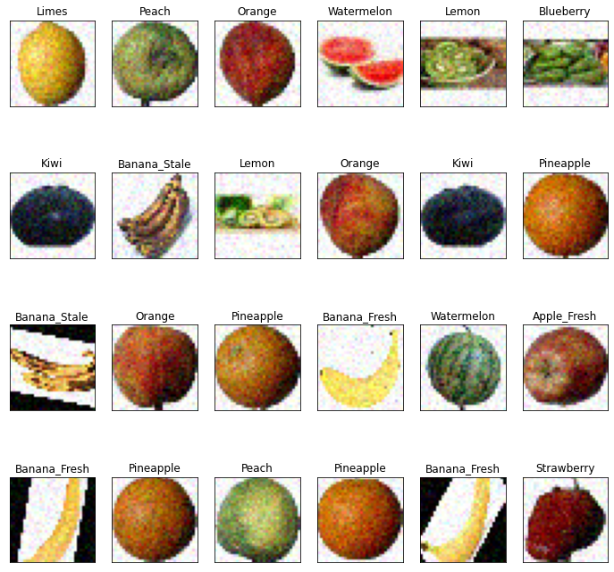
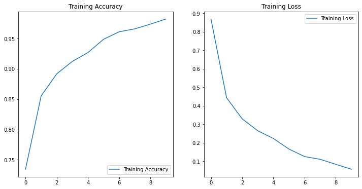
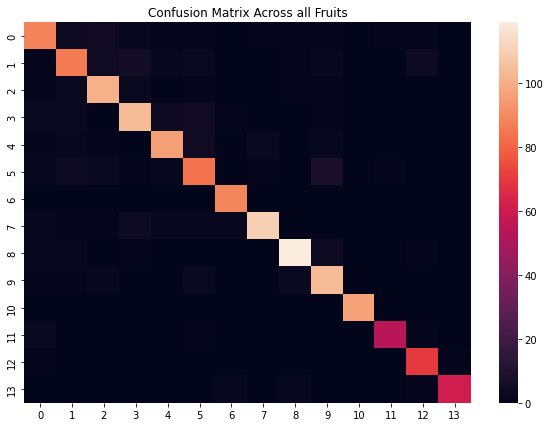

# Fruit Image Classification Project

## Introduction
This repository contains a fruit image classification project implemented in Jupyter Notebooks. The project focuses on training a Convolutional Neural Network (CNN) to classify various fruits and their freshness. Additionally, a separate file allows real-time predictions using a webcam input using the pre-trained model. This project was the culmination of CS254: Machine Learning at the University of Vermont. It was presented at the University of Vermont's Computer Science Fair in December of 2022.

## Project Structure

1. **Data Processing, Model Training and Evaluation**
   - `fruit_classification.ipynb`: This contains all the code necessary to read data, add noise, train model, check accuracy, etc. (best to use Colab for training and data loading)
    - Code Blocks 1-6: connect your drive and import necessary libraries 
    - Code Blocks 7-9: read the fruit names and image data
    - Code Block 11-12: manually add noise to each image, show an image of an example noisy image
    

    - Code Block 13: preprocess data, normalize it, split testing and training, create model, and train model
    - Code Block 14: Not necessary to run, checking the model prediction accuracy
    - Code Block 15-19: Model evaluation and metrics
     
    
    - Code Block 20: graph showing noisy data

2. **Model File**
   - `new_trained_model.h5`: This file contains the trained model that classifies fruits.

3. **Real-Time Prediction**
   - `model_webcam.ipynb`:  This notebook provides a detailed analysis of the trained model's performance, including accuracy, loss, and confusion matrices. It also discusses potential improvements and areas for optimization.

4. **Fruit Images**
   - `fruits.zip`: This zip file includes all the images used to train and test the model. In total, there are 14135 images. Access this file on [Google Drive](https://drive.google.com/file/d/1B2UI5_OgKB3FAp22U3sujC_aEiIYY89F/view?usp=sharing).

## Getting Started
To get started with this project, follow these steps:

1. To re-train the model, run  `fruit_classification.ipynb`. This step is optional.

2. To perform real-time predictions, open and run `model_webcam.ipynb`. Ensure the `new_trained_model.h5` file exists in your current directory.

## Dataset
The dataset used for this project contains images of various fruits and spoiled apples and bananas. You can replace or expand this dataset as needed for your specific application.
